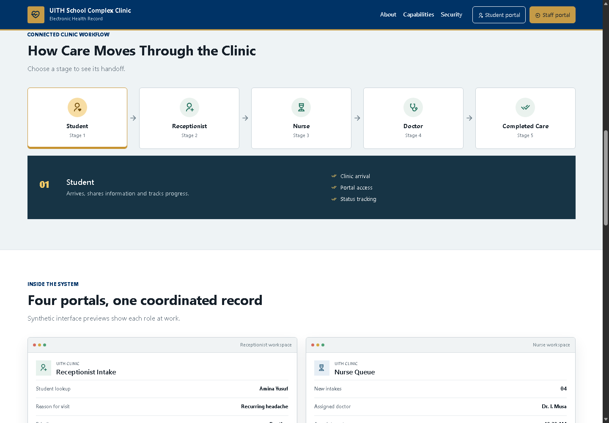
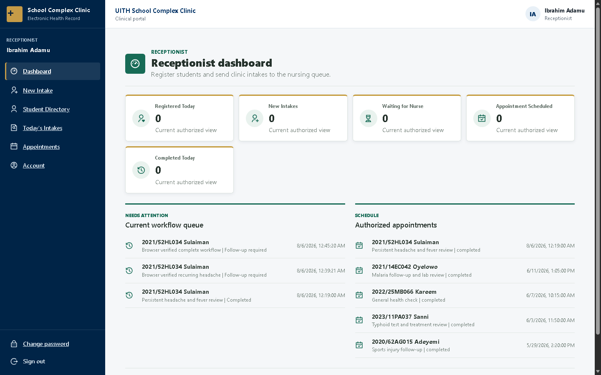
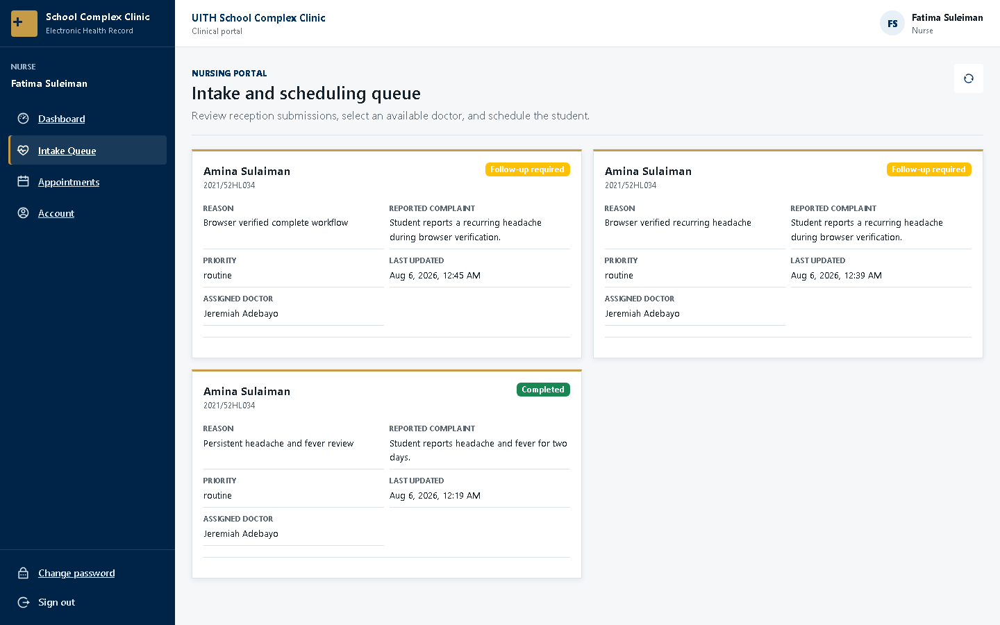
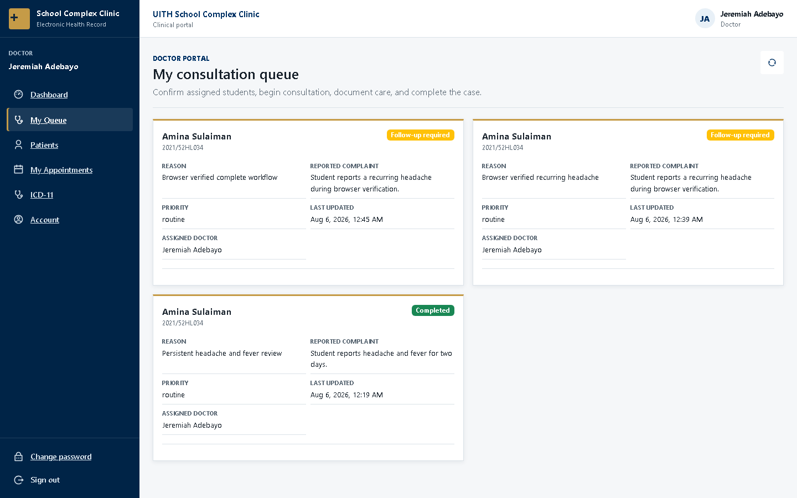
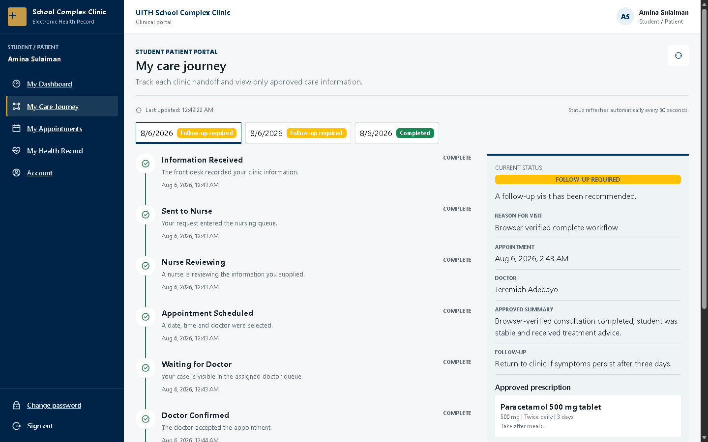
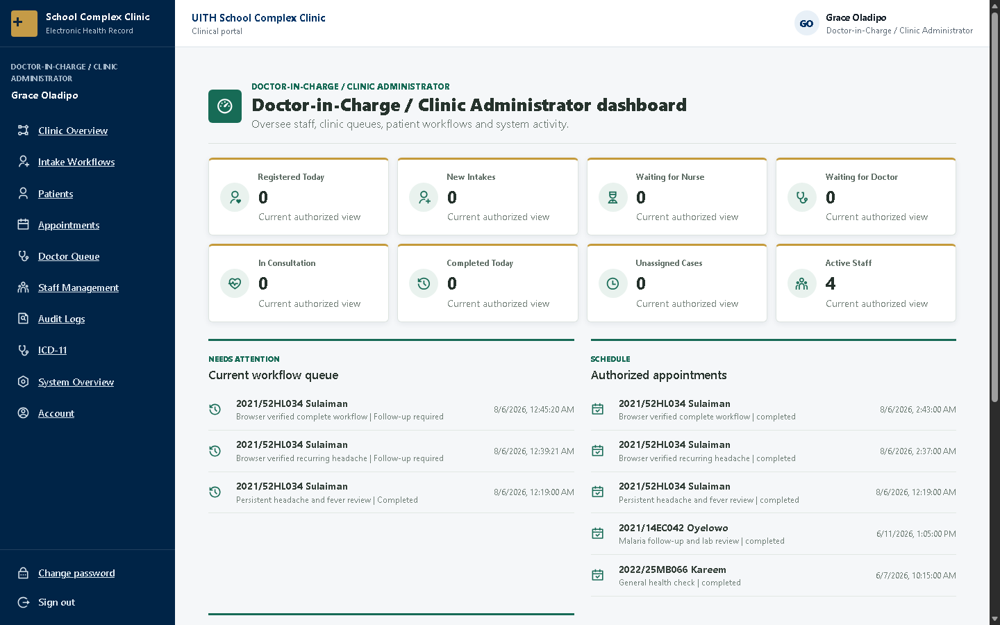

# UITH School Complex Clinic EHR

This repository contains the final-year project **Design and Implementation of
Health Clinical Database Information** for the University of Ilorin Teaching
Hospital School Complex Clinic, Amilegbe, Ilorin. It is an existing Django REST
Framework and React application that has been hardened and extended in place.

> **Academic project only:** Academic clinical information-system prototype
> using synthetic demonstration data. This is not an officially deployed UITH
> or LAUTECH production healthcare system. Do not use it for real patient care.

All included patient and account information is synthetic demonstration data.
Do not enter real patient information in an unsecured development environment.

## Live deployment

| Resource | Address |
|---|---|
| GitHub repository | [Private source repository](https://github.com/MSalaam20/uith-clinical-information-system) |
| React application | [Vercel production application](https://uith-clinical-information-system.vercel.app/) |
| Django API | [Railway production API](https://uith-clinical-information-system-production.up.railway.app/api/) |
| Health check | [Railway health endpoint](https://uith-clinical-information-system-production.up.railway.app/health/) |
| Swagger | [Production Swagger](https://uith-clinical-information-system-production.up.railway.app/swagger/) (administrator-only) |
| ReDoc | [Production ReDoc](https://uith-clinical-information-system-production.up.railway.app/redoc/) (administrator-only) |

The frontend, backend health endpoint, direct SPA route fallback, and Vercel-to-
Railway CORS response were verified over HTTPS on August 11, 2026. The source
repository remains private.

## Interface evidence

All screenshots below contain controlled synthetic demonstration data.



| Receptionist portal | Nurse queue |
|---|---|
|  |  |

| Doctor queue and consultation entry | Student care journey |
|---|---|
|  |  |



## Technology stack

- Python 3.11, Django 5.0, Django REST Framework 3.14
- Djoser and SimpleJWT authentication
- MariaDB/MySQL-compatible database through PyMySQL 1.1.1
- React 18, Redux Toolkit, Axios, Bootstrap, FullCalendar and RJSF
- phpMyAdmin as an optional database-administration interface only
- Nginx and Docker Compose
- Swagger and Redoc in development

MariaDB/MySQL is the required database engine. The active local server is
MariaDB 10.4.32 through PyMySQL, with InnoDB tables and `utf8mb4` encoding.
This completion does not force a local MySQL 8 upgrade. The optional Docker
environment retains a MySQL 8 service for independent container deployments.
The implementation does not use PostgreSQL. phpMyAdmin may inspect or administer
the database, but the application backend remains Django.

## Main features

- Doctor-in-Charge, doctor, nurse, receptionist and student portals
- Reception-to-nurse-to-doctor intake and consultation workflow
- Student registration and exact matriculation-number portal identity
- Appointments, visits, vital signs, notes, ICD-11 diagnoses and prescriptions
- Student-visible care journey and approved clinical outcomes
- Staff provisioning, account lifecycle controls and append-oriented audit logs
- Backend-enforced role and ownership permissions with JWT authentication

## Database design summary

The normalized MySQL/MariaDB model links one patient identity to repeat clinic
intakes, appointments and visits. Visits own structured vital signs, clinical
notes, diagnoses and prescriptions; prescriptions own validated line items.
Foreign keys preserve clinical relationships, transactions protect multi-step
state changes, InnoDB supplies referential integrity, and `utf8mb4` supports
complete Unicode storage. A schema-driven record subsystem remains available
for controlled custom clinical forms.

## Deployment architecture

- GitHub stores the private-first source repository and runs CI.
- Vercel builds only `frontend/` and hosts the React SPA on HTTPS.
- Railway builds only `backend/` and runs Django through Gunicorn.
- Railway MySQL runs in the same Railway project; Django uses its private host.
- `REACT_APP_BASE_URL` points the Vercel build to the Railway `/api/` URL.
- No PostgreSQL service, custom paid domain, Redis or Celery service is needed.

See [DEPLOYMENT.md](DEPLOYMENT.md) for provider setup and
[RELEASE_CHECKLIST.md](RELEASE_CHECKLIST.md) for release evidence.

## Project structure

```text
EHR/
|-- backend/                 Django project and applications
|   |-- backend/             Settings, root URLs and shared API views
|   |-- organization/        Clinic and department models
|   |-- patients/            Patients and appointments
|   |-- records/             Dynamic records and normalized clinical data
|   |-- users/               Profiles, roles, authentication and permissions
|   `-- utils/               JSON schema and embedded-file helpers
|-- frontend/                React application
|   |-- public/
|   `-- src/                 API, Redux slices, routes and UI components
|-- infra/                   Docker Compose, Nginx and environment example
|-- API_WORKFLOW_MAP.md      API, role and React consumer mapping
|-- dfd.drawio               Data-flow diagram source
`-- use case.png             Use-case diagram
```

## Prerequisites

- Python 3.11 or a compatible supported Python version
- The working MariaDB 10.4.32 server, or a compatible MySQL/MariaDB server
- phpMyAdmin when a graphical database-administration interface is desired
- Node.js 20 LTS and npm
- Docker Desktop only when using the container workflow

## Environment variables

Use `infra/.env.example` as the template. Required production values include:

```dotenv
DJANGO_SECRET_KEY=replace-with-a-long-random-production-secret
DJANGO_DEBUG=False
DJANGO_ALLOWED_HOSTS=ehr.example.invalid
DJANGO_CORS_ALLOWED_ORIGINS=https://ehr.example.invalid
DJANGO_CSRF_TRUSTED_ORIGINS=https://ehr.example.invalid
DB_ENGINE=django.db.backends.mysql
DB_NAME=uith_ehr_db
DB_USER=uith_ehr_user
DB_PASSWORD=replace-with-a-strong-database-password
DB_HOST=127.0.0.1
DB_PORT=3306
DJANGO_USE_PROXY_SSL_HEADER=True
DJANGO_SECURE_SSL_REDIRECT=True
DJANGO_SESSION_COOKIE_SECURE=True
DJANGO_CSRF_COOKIE_SECURE=True
DJANGO_SECURE_HSTS_SECONDS=31536000
DJANGO_SECURE_HSTS_INCLUDE_SUBDOMAINS=True
DJANGO_SECURE_HSTS_PRELOAD=True
DJANGO_API_DOCS_PUBLIC=False
FRONTEND_URL=https://ehr.example.invalid
DEFAULT_FROM_EMAIL=clinic@example.invalid
SHOW_DEMO_CREDENTIALS=False
ALLOW_DEMO_ACCOUNTS=False
```

The legacy `MYSQL_DATABASE`, `MYSQL_USER`, `MYSQL_PASSWORD`, `MYSQL_HOST` and
`MYSQL_PORT` names remain supported for existing local environments. Legacy
security variable names also remain usable where previously configured. Secret
`.env` files are ignored by Git.

## Local database setup

Create a dedicated database and user using an authorized MySQL administrator:

```sql
CREATE DATABASE uith_ehr_db
  CHARACTER SET utf8mb4
  COLLATE utf8mb4_unicode_ci;
CREATE USER 'uith_ehr_user'@'localhost' IDENTIFIED BY 'replace-this-password';
GRANT ALL PRIVILEGES ON uith_ehr_db.* TO 'uith_ehr_user'@'localhost';
```

InnoDB is required for transactions, foreign keys and referential integrity.
The Django connection also enables strict transactional SQL mode. For the
existing local database, use phpMyAdmin to inspect the database, engine,
collation and indexes; never expose phpMyAdmin publicly or embed its credentials
in this application.

## Backend setup

From PowerShell:

```powershell
cd backend
python -m venv .venv
.\.venv\Scripts\Activate.ps1
python -m pip install -r requirements.txt
python manage.py check
python manage.py makemigrations --check --dry-run
python manage.py migrate
python manage.py bootstrap_admin
python manage.py runserver 127.0.0.1:8001
```

`bootstrap_admin` requests username, email, names, password and confirmation.
Password entry is hidden, Django's configured password validators run, the user
and one-to-one clinic profile are updated in a transaction, and no password is
printed or stored in source. Optional identity arguments still preserve the
hidden password prompt:

```powershell
python manage.py bootstrap_admin --username clinic.admin --email admin@example.invalid --first-name Clinic --last-name Administrator
```

Controlled automation may use `--noinput` with the temporary environment
variable named by `--password-env`; never place that value in a committed file
or command history.

For synthetic development or defence accounts only:

```powershell
$env:EHR_DEMO_PASSWORD='<temporary defence password>'
python manage.py seed_uith_data
python manage.py seed_demo_data
```

`seed_demo_data` is idempotent and is blocked unless `DJANGO_DEBUG=True` or
`ALLOW_DEMO_ACCOUNTS=True`. `seed_demo_accounts` remains as a compatibility
alias. The landing page requests credentials only when `SHOW_DEMO_CREDENTIALS`
is true and `EHR_DEMO_PASSWORD` is present in the backend process; otherwise no
credential values are returned, rendered or bundled. Remove the environment
value and disable both flags before any real deployment.

## Frontend setup

The selected package manager is npm. `package-lock.json` is authoritative.

```powershell
cd frontend
npm.cmd ci
npm.cmd test
$env:PORT=3001
npm.cmd start
```

The checked development client uses `http://127.0.0.1:8001/api/`. Override it with
`REACT_APP_BASE_URL` when required. A production build is created with:

```powershell
npm.cmd run build
```

## Docker setup

Create `infra/.env` from the example and replace every placeholder, then run:

```powershell
cd infra
docker compose config
docker compose up --build
```

Compose starts MySQL 8.0, Django/Gunicorn, the built React/Nginx frontend and a
reverse-proxy Nginx service at `http://localhost:8000`. MySQL uses a persistent
named volume and a health check. Redis and Celery runtime services were disabled
because the application currently defines no task queue configuration or tasks.

## Authentication and roles

Both portals use JWT authentication, but `portal_type` is verified by the
backend and frontend. The current profile is always resolved through
`GET /api/profile/me/`; a frontend-supplied Profile ID is never trusted.

| Role | Main authorized behavior |
|---|---|
| Doctor-in-Charge (`AD`) | Clinic oversight, staff, audit, reassignment, correction, archive and doctor care |
| Doctor (`DC`) | Assigned queue, consultation, notes, diagnosis, prescription and completion |
| Nurse (`NS`) | Submitted-intake review, doctor assignment, scheduling and queue status |
| Receptionist (`RC`) | Student lookup/registration, demographics, intake creation and nursing handoff |
| Clinical Officer (`CO`) | Restricted operational summary and account access |
| Student/patient (`PT`) | Own care journey, appointments and approved clinical history only |

The DRF default is `IsAuthenticated`. Public access is explicitly limited to
authentication endpoints and development API documentation. A denied role gets
HTTP 403; a missing or invalid token gets HTTP 401.

No default administrator password is seeded. Create or update the first
administrator through the protected local command:

```powershell
cd backend
python manage.py bootstrap_admin
```

Then start React, sign in through the Clinical Staff Portal, open **Staff
management**, and create doctors, nurses, receptionists or coordinators. Open a
verified patient profile to create the linked student account. Each new account
receives a temporary password shown once; deliver it securely to the intended
user. The user must sign in through the correct portal and set a permanent
password before ordinary application routes become available.

## Main API routes

| Route | Purpose |
|---|---|
| `POST /api/auth/jwt/create/` | Portal-aware JWT login |
| `POST /api/auth/jwt/refresh/` | Access-token refresh |
| `GET /api/profile/me/` | Authenticated profile and role |
| `POST /api/account/change-password/` | Temporary or normal authenticated password change |
| `POST /api/account/password-reset/` | Generic password-reset email request |
| `POST /api/account/password-reset/confirm/` | Token-validated password reset |
| `GET /api/demo-access/` | Flag-gated synthetic defence credentials |
| `/api/patients/` | Patient CRUD, search and administrator archive |
| `/api/clinic-intakes/` | Role-filtered intake state machine and care journey |
| `POST /api/clinic-intakes/{id}/submit/` | Reception-to-nurse handoff |
| `POST /api/clinic-intakes/{id}/schedule/` | Nurse doctor assignment and scheduling |
| `POST /api/clinic-intakes/{id}/confirm/` | Assigned-doctor confirmation |
| `POST /api/clinic-intakes/{id}/start-consultation/` | Transactional visit creation/opening |
| `POST /api/clinic-intakes/{id}/complete/` | Doctor completion or follow-up outcome |
| `/api/patients/{id}/portal-account/` | Administrator/receptionist student account linking |
| `/api/appointments/` | Appointment CRUD and cancellation |
| `PATCH /api/appointments/{id}/status/` | Permitted appointment status change |
| `/api/visits/` | Structured encounters |
| `/api/vital-signs/` | Structured observations |
| `/api/clinical-notes/` | Clinical and nursing notes |
| `/api/diagnoses/` | Diagnoses with optional ICD-11 code |
| `/api/medications/` | Medication catalogue |
| `/api/prescriptions/` | Prescriptions and items |
| `/api/records/` | Legacy/custom schema-driven clinical forms |
| `/api/icd-11/search/` | Curated local ICD-11 demonstration search |
| `/api/audit-logs/` | Administrator-only append-oriented audit trail |
| `/api/staff/` | Administrator-only staff listing and account creation |
| `POST /api/staff/{id}/reset-temporary-password/` | Administrator-issued one-time staff password |
| `PATCH /api/staff/{id}/status/` | Administrator-only activation/deactivation |
| `/api/dashboard/summary/` | Role-filtered live dashboard values |
| `GET /health/` | Public non-sensitive backend liveness check |

Swagger is available at `/swagger/` and Redoc at `/redoc/` when
`DJANGO_DEBUG=True`. Production documentation access is administrator-only.

## Completed clinical workflow

The React patient workspace supports the daily workflow without requiring
Swagger:

1. Reception finds or registers the student and creates a clinic intake.
2. Reception records the student-reported complaint and submits it to nursing.
3. Nursing begins review, chooses an available doctor and schedules the visit.
4. The appointment appears in the nurse calendar, doctor queue and student journey.
5. The assigned doctor confirms and starts the consultation, opening one linked visit.
6. The doctor records permitted vitals, notes, ICD-11 diagnosis and prescription.
7. Completion publishes the approved summary and optional follow-up instructions.
8. The student sees only their own timeline, appointment and approved clinical output.
9. A later intake reuses the same patient and account and preserves prior history.

Completed and cancelled visits are read-only through both React controls and
backend serializers. See `API_WORKFLOW_MAP.md` for the endpoint, role and
frontend-consumer mapping.

Administrators additionally have `/staff` and `/audit-logs` workspaces. Students
are automatically routed to their linked patient and cannot retrieve another
patient by changing a URL.

## Account provisioning sequence

1. Start MariaDB/MySQL and run migrations.
2. Start Django on `http://127.0.0.1:8001/`.
3. Run `python manage.py bootstrap_admin` for the first administrator.
4. Start React on `http://127.0.0.1:3001/`.
5. Sign in through the Clinical Staff Portal.
6. Open Staff management and create staff accounts.
7. Open a patient profile and create its linked student portal account.
8. Give the one-time temporary credential to the intended user securely.
9. The user signs in through the appropriate portal and changes the password.
10. The old temporary credential and all earlier JWT sessions are invalid.

Password-reset emails use Django's configured email backend. Development
defaults to the console backend; production must configure an authenticated
SMTP or transactional-email backend and the correct `FRONTEND_URL`.

## Current local ports

- Frontend: `http://127.0.0.1:3001/`
- Backend API: `http://127.0.0.1:8001/api/`
- Swagger: `http://127.0.0.1:8001/swagger/`

Ports 3000 and 8000 currently have older Node/Python listeners. Inspect them
without terminating anything:

```powershell
netstat -ano | Select-String -Pattern ':3000\s|:3001\s|:8000\s|:8001\s'
Get-Process -Id <PID> | Select-Object Id,ProcessName,Path,StartTime
```

## Verification

Backend:

```powershell
cd backend
python manage.py check
python manage.py makemigrations --check --dry-run
python manage.py showmigrations
python manage.py test --verbosity 2
```

Frontend:

```powershell
cd frontend
npm.cmd ci
npm.cmd ls --depth=0
npm.cmd test
npm.cmd run build
```

Latest verified local result (6 August 2026): Django found 84 tests and all 84
passed in 371 seconds; Jest ran 54 tests across 17 suites and all 54 passed in
42.566 seconds. The dependency-tree check and `pip check` also succeeded. The
route-split React build compiled successfully with a 134.6 kB initial
JavaScript bundle and 38.46 kB main CSS bundle after gzip; operational routes
are emitted as on-demand chunks. The older CRA toolchain emits a Node
`fs.F_OK` deprecation notice after compilation; it did not prevent testing or
the production build.

Docker, when installed:

```powershell
cd infra
docker compose config
docker compose build
```

## Security notes

- Access and refresh tokens are held in per-tab `sessionStorage` and removed on
  logout or failed refresh. An HTTP-only cookie design would be preferable for
  a production deployment and requires a coordinated backend change.
- Password and account-status changes increment a per-profile token version;
  JWTs issued before that change are rejected by the API.
- Newly provisioned accounts are restricted to profile and password-change
  endpoints until a validated permanent password is set.
- Patient access is filtered through the authenticated `User` to `Patient`
  relationship; submitted patient IDs do not override ownership.
- Patient and clinical-history deletion is not exposed through ordinary APIs.
  Doctor-in-Charge archive/correction actions require a reason and are audited.
- Embedded record images are restricted to JPEG, PNG and WebP, limited to 5 MB,
  assigned generated names and constrained to their record directory.
- `ALLOW_MEDIA_UPLOADS=False` blocks new patient photographs and embedded record
  images when durable media storage has not been configured.
- Audit metadata recursively excludes password, token, authorization and secret
  keys, including nested objects and arrays. Audit records are read-only through
  the API and Django administration.
- Multi-item prescriptions are validated before persistence and created inside
  a database transaction. A failed item cannot leave a partial prescription.
- Clinical notes default to staff-only and must be explicitly marked patient
  visible before they are returned through a student visit response.
- Do not deploy with the example secrets, demo passwords, `DJANGO_DEBUG=True`,
  or unrestricted documentation access.

## Known limitations

- ICD-11 search is a seven-term curated local demonstration subset, not the full
  WHO API and not a claim of full ICD or FHIR compliance.
- Failed login auditing records the account identifier and outcome but not the
  request IP because SimpleJWT serializer validation has no request context in
  the current implementation.
- Docker execution is not verified on this computer because Docker Desktop is
  not installed; local Django, React and MariaDB are the verified path.
- Production password-reset email remains unavailable while the console email
  backend is selected. Password changes continue to work; a real email provider
  must be configured and tested before reset delivery is claimed.
- Media persistence is unverified until a Railway volume is mounted at
  `/app/media` and survives a redeployment. The initial safe setting disables
  upload mutation instead of relying on an ephemeral filesystem.
- The role workflow is also exercised in headless Microsoft Edge through the
  DevTools protocol. Evidence is stored in `docs/BROWSER_VERIFICATION.json` and
  `docs/screenshots/`; `scripts/browser_verify.mjs` reproduces the checks.
- The most recent recorded `npm audit --omit=dev` reports two moderate React
  Router advisories. A fresh online audit was unavailable during deployment
  preparation, so this remains the latest known result rather than a new scan.
  The available v7 releases overlap with a newer high-severity RSC advisory, so
  the verified v6 line was retained. This client uses no SSR/RSC and no
  user-controlled redirect targets. The full audit also reports findings in CRA
  build/test tooling that is not copied into the final Nginx image.

## Academic alignment

The academic report must state that the implementation uses **MySQL**, not
PostgreSQL. The database justification should explain that MySQL with InnoDB
supports ACID transactions, foreign keys, indexes and normalized clinical data,
while `utf8mb4` supports complete Unicode storage.

The implemented terminology is **ICD-11**, currently represented by a curated
local subset. Any report section that says ICD-10 must be changed to ICD-11 or
must explicitly justify the difference. The data model and diagrams should add
Visit, VitalSign, ClinicalNote, ICDCode, Diagnosis, Medication, Prescription,
PrescriptionItem and AuditLog, while describing Record/Schema/Template as the
optional dynamic-form subsystem. API and testing chapters should include
`/api/profile/me/`, portal separation, ownership checks, 401/403 behavior,
normalized clinical routes, audit logging and the automated test evidence.

See `ACADEMIC_CORRECTIONS.md` for exact report edits and `DEFENCE_DEMO.md` for
the defence-day demonstration sequence.

## Release information

- Starting deployment-preparation commit: `ee1fe68`
- Intended first stable portfolio tag: `v1.0.0`
- Current release state: local preparation in progress; hosted provider steps
  remain pending until browser authentication and private repository creation
- No explicit software licence is included in this repository
